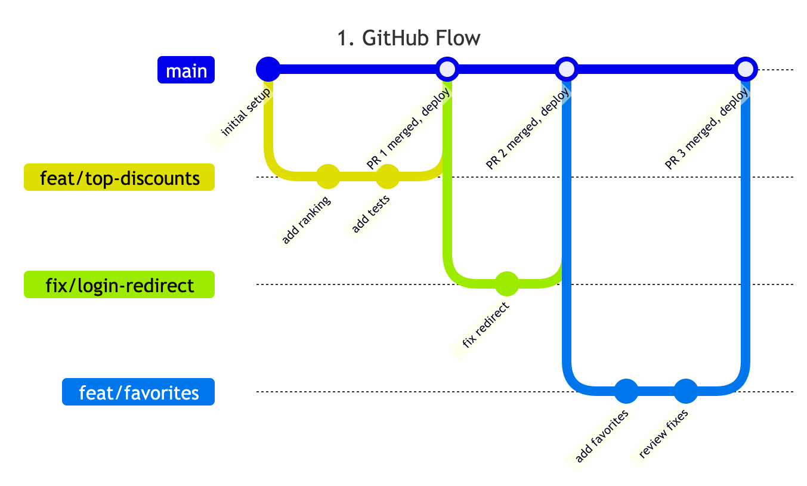

# Decisions

Team decisions for Bargainu, newest first. Add an entry when the team agrees something that
changes how we work or what we build. Recorded on the date shown; the team is Yuta, Norty and Mizuki.

## 5. Tech stack: all on Cloudflare (2026-10-06)

**Decision:** option A of the tech stack proposal. Everything runs in the team's Cloudflare
account, on the free plan.

| Part | Choice |
|---|---|
| Frontend | Vite + React + TypeScript |
| API | Hono on a Cloudflare Worker, deployed together with the frontend |
| Database | Cloudflare D1 (SQLite) |
| Queries and migrations | Drizzle |
| Login | Better Auth with Google sign-in |
| Lint | Oxlint |
| Format | Oxfmt |
| Data collection | A separate collector, run on a schedule by GitHub Actions |

**Why:** one account and one deploy, nothing that sleeps or pauses, and it costs nothing. The
chosen design is already a Vite + React app, so its tokens and components carry over.

**Options considered:** A, all Cloudflare with D1; B, Cloudflare with Neon Postgres; C, Cloudflare
with Supabase Postgres. Next.js was ruled out: Cloudflare's path for new Next.js apps is in beta,
and showing up in search results is not in scope for v1. The comparison, with free-plan limits and
sources, is at https://claude.ai/artifact/HYTbWomd48yP4XBSGscFzh. Agreed by Yuta and Mizuki in
Slack; Norty had not replied when this was recorded.

**What follows:**

- The collector is independent of the app. Whoever builds it chooses how, including the language.
  It cannot connect to D1 directly, so it sends its data to a protected endpoint on the Worker,
  or writes files to R2 for a Worker to load.
- Where the data can come from, as far as we have checked: Rakuten has an official Ichiba Item
  Search API. Amazon's Product Advertising API 5 is deprecated and replaced by the Creators API,
  which is for affiliate partners; what it takes to qualify is not checked. Yodobashi most likely
  has to be scraped; we have not looked for an official API or read its terms of use.
- If the import step into D1 proves painful, option B is the fallback. Drizzle supports both
  databases.

**Not checked yet:** whether Better Auth's Google sign-in and a collector import each fit in the
free plan's 10 ms of CPU per request. Test both during the initial project setup.

## 4. Hosting: Cloudflare (2026-10-05)

**Decision:** the app is hosted on Cloudflare, in a team account that Mizuki created and invited
everyone to.

**Why:** Vercel's free tier does not let the three of us collaborate on one project. Cloudflare's
does, and it also gives us Workers, Pages and R2 at low cost.

**Options considered:** Vercel (the original proposal in the README) and Cloudflare. Agreed in
the #brainstorming channel on Slack.

**What follows:** the prototypes are still on Yuta's personal Cloudflare account and move to the
team account during the initial project setup. The backend and database are not decided yet.

## 3. UI/UX: prototype 3, "Chirashi" (2026-10-05)

**Decision:** the app is built on prototype 3, the reference-driven design in a Japanese sale-flyer
style.

- Live: https://bargainu-prototypes.asakurayuta.workers.dev/3/
- Design system: [DESIGN.md](../DESIGN.md)
- Screenshots of every screen: [docs/design/reference/](design/reference/README.md)
- Code: [prototypes/3-reference/](../prototypes/3-reference/)

**Options considered:** three prototypes with the same screens and data, compared at
https://bargainu-prototypes.asakurayuta.workers.dev.

| # | Recipe | Outcome |
|---|---|---|
| 1 | frontend-design + web-design-guidelines + Emil Kowalski | not chosen |
| 2 | Impeccable + Taste Skill | not chosen |
| 3 | References from Awwwards and footer.design, motion from `fancy` | **chosen** |

How each was built is in [docs/design/recipes/](design/recipes/README.md).

**What follows:** UI work reads `DESIGN.md` first and uses its tokens. Prototypes 1 and 2 stay in
`prototypes/` as a record until the team decides to remove them.

## 2. Git branching: GitHub Flow (2026-10-05)

**Decision:** we use GitHub Flow.

How it works for us:

1. `main` is always deployable. Nobody commits to it directly.
2. Start each piece of work on a short branch off `main`, named for what it does:
   `feat/top-discounts`, `fix/login-redirect`.
3. Push the branch and open a pull request.
4. After review, merge the pull request into `main` and delete the branch.
5. Every merge to `main` is deployed.

**Options considered:** [GitHub Flow](branching/1-github-flow.drawio.png),
[Git Flow](branching/2-git-flow.drawio.png) and
[trunk-based development](branching/3-trunk-based.drawio.png). The editable diagrams are the
`.drawio` files next to each image.

**Not decided yet:** how many approvals a pull request needs, whether merges are squashed, and
whether `main` gets branch protection on GitHub.

## 1. Project management: Linear (2026-10-05)

**Decision:** work is tracked in Linear, in the Sidequest Club workspace, on the free plan.
Issue keys start with `SID-`.

Collaborative documents are being tried in Notion.
